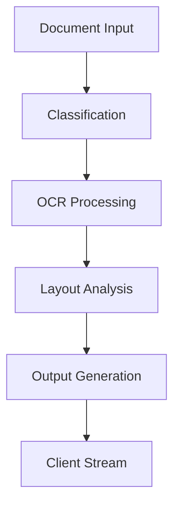

# OCR Data Pipeline Design

## Table of Contents
- [Introduction and Requirements](#introduction-and-requirements)
- [High-Level Architecture Overview](#high-level-architecture-overview)
- [Pipeline Components and Workflow](#pipeline-components-and-workflow)
  - [Data Ingestion & Storage Abstraction](#1-data-ingestion--storage-abstraction)
  - [Document Classification Service](#2-document-classification-service-mistral-model)
  - [OCR Service](#3-ocr-service-text-extraction-engine)
  - [Layout Analysis and Component Detection](#4-layout-analysis-and-component-detection-layoutlmv3)
  - [Data Output Handling](#5-data-output-handling-structured-and-unstructured-outputs)
  - [Asynchronous Processing and SSE](#6-asynchronous-processing-and-sse-for-real-time-streaming)
  - [Quality Assurance and Validation Layer](#7-quality-assurance-and-validation-layer)
  - [Orchestration with Airflow](#8-orchestration-with-airflow-quality-control--scheduling)
  - [Distributed Data Handling with PySpark](#9-distributed-data-handling-with-pyspark)
  - [Model Tracking and Deployment](#10-model-tracking-and-deployment-mlflow-integration)
- [Scalability, Resources, and Performance Optimization](#scalability-resources-and-performance-optimization)
  - [Horizontal Scaling and Extensibility](#horizontal-scaling-and-extensibility)
  - [Resource Provisioning Recommendations](#resource-provisioning-recommendations)
  - [Throughput and Performance Optimizations](#throughput-and-performance-optimizations)
  - [Fine-Tuned Mistral Model Training Configuration](#fine-tuned-mistral-model-training-configuration)
  - [Cloud-Agnostic Deployment Considerations](#cloud-agnostic-deployment-considerations)
- [Conclusion](#conclusion)

---

## Introduction and Requirements

Handling up to 100,000 multi-page documents in both batch and real-time modes is a significant engineering challenge. The goal is to achieve fast turnaround (≈60 seconds for a 100-page document) without sacrificing accuracy or reliability. To meet these requirements, we propose a cloud-agnostic, modular pipeline that integrates several powerful tools:

- Ray for parallel processing
- Apache Airflow for orchestration and quality control
- PySpark for distributed data handling
- MLflow for model tracking and deployment

The system is designed to be horizontally scalable, extensible, and deployable on generic cloud infrastructure (e.g. AWS EC2 or on-prem Kubernetes) rather than tied to specific proprietary services.

### Key Features

- **Microservices Architecture**: Each pipeline stage (OCR, layout analysis, data conversion, etc.) is isolated, allowing independent scaling and upgrades
- **Layout-aware Document Understanding**: Uses LayoutLMv3-based model to detect document components with multimodal context
- **Asynchronous Processing**: Parallel processing at page/layout-segment level using Ray
- **Real-time Streaming**: Server-Sent Events (SSE) support for incremental results
- **Confidence-based QA**: Fallback mechanisms and human review for low-confidence cases
- **Flexible Output Handling**: Support for JSON, CSV, Markdown, and database storage
- **Validation Layer**: JSON schema verification and field-level quality checks
- **Storage Abstraction**: Seamless reading/writing from S3, HDFS, or local file systems
- **BFSI Domain Integration**: Fine-tuned Mistral LLM for document classification

---

## High-Level Architecture Overview

The pipeline processes documents through a sequence of stages, each handled by a dedicated service:


### Key Architectural Elements

1. **Orchestration & Workflow Manager**
   - Airflow DAG for batch processing
   - FastAPI with Ray Serve for real-time requests

2. **Parallel Compute Layer**
   - Ray cluster for distributed processing
   - Layout-level parallelism
   - Multi-document parallel processing

3. **Data and Model Storage**
   - Abstracted storage layer
   - MLflow for model tracking
   - Model registry integration

4. **Messaging/Queueing**
   - Internal message broker (optional)
   - Ray task scheduling
   - Airflow for batch jobs

5. **Monitoring & Logging**
   - Component metrics
   - MLflow tracking
   - Custom monitoring dashboards

---

## Pipeline Components and Workflow

### 1. Data Ingestion & Storage Abstraction

#### Ingestion
- Multiple input paths (batch/real-time)
- Document registration in metadata store
- Processing initiation

#### Storage Abstraction
- Unified interface for file operations
- Support for multiple backends:
  - S3
  - HDFS
  - Local filesystem
- Plugin-based extensibility

#### Data Locality Considerations
- Compute near data optimization
- Parallel download capabilities
- Caching implementation

### 2. Document Classification Service (Mistral Model)

#### Model Selection
- Fine-tuned Mistral 7B
- Fast inference capabilities
- Domain-specific training

#### Model Serving
- Ray Serve deployment
- GPU acceleration
- Async request handling

#### Training Configuration
```python
# Example training parameters
training_config = {
    "learning_rate": 2e-5,
    "batch_size": 4,
    "gradient_accumulation": 8,
    "epochs": 3
}
```

### 3. OCR Service (Text Extraction Engine)

#### Parallelization Strategy
- Page-level parallelism
- Ray task distribution
- Resource-aware scheduling

#### OCR Engine Configuration
```python
# Example OCR configuration
ocr_config = {
    "engine": "Tesseract",
    "language": "eng",
    "dpi": 400,
    "deskew": True
}
```

#### Output Format
```json
{
    "page": 1,
    "words": [
        {
            "text": "Example",
            "x": 100,
            "y": 50,
            "confidence": 0.95
        }
    ]
}
```

### 4. Layout Analysis and Component Detection (LayoutLMv3)

#### Component Detection
- Zones/Sections
- Form Fields
- Tables
- Headings
- Lists
- Signatures/Stamps

#### Processing Strategy
- Page-level processing
- GPU acceleration
- Batch inference

### 5. Data Output Handling

#### Output Formats
- JSON
- CSV
- Markdown
- Database records
- Vector embeddings

#### Storage Options
- Object storage
- Relational databases
- Vector databases

### 6. Asynchronous Processing and SSE

#### Real-time Streaming
- SSE implementation
- Progressive updates
- Error handling

#### Event Flow


### 7. Quality Assurance and Validation Layer

#### Validation Components
- JSON schema validation
- Confidence scoring
- Business rule checks
- Cross-field validation

#### Fallback Mechanisms
- Automated reprocessing
- LLM-assisted correction
- Human review integration

### 8. Orchestration with Airflow

#### DAG Structure
```python
# Example Airflow DAG
with DAG('document_processing') as dag:
    classify = PythonOperator(task_id='classify')
    ocr = PythonOperator(task_id='ocr')
    layout = PythonOperator(task_id='layout')
    validate = PythonOperator(task_id='validate')
    
    classify >> ocr >> layout >> validate
```

#### Quality Control Integration
- Aggregate metrics
- Alerting system
- SLA monitoring

### 9. Distributed Data Handling with PySpark

#### Use Cases
- Initial data loading
- Partitioning
- Aggregation
- Feature engineering

#### Integration Points
- Ray integration
- MLflow tracking
- Storage abstraction

### 10. Model Tracking and Deployment

#### MLflow Integration
- Experiment tracking
- Model registry
- Deployment management
- Metrics logging

---

## Scalability, Resources, and Performance Optimization

### Horizontal Scaling and Extensibility

#### Scaling Features
- Microservice isolation
- Kubernetes orchestration
- Distributed work queues
- Stateless API layer

### Resource Provisioning Recommendations

#### Hardware Requirements
- CPU Nodes: 32+ cores, 32-64GB RAM
- GPU Nodes: NVIDIA A10G/A100
- Storage: NVMe SSDs
- Network: 10+ Gbps

### Throughput and Performance Optimizations

#### Optimization Strategies
- Parallelism tuning
- Batch inference
- Actor-based processing
- Memory management
- Caching
- Concurrent I/O

### Fine-Tuned Mistral Model Training Configuration

#### Training Setup
- Data preparation
- Hyperparameters
- Hardware requirements
- Model optimization

### Cloud-Agnostic Deployment Considerations

#### Deployment Options
- AWS (EKS, EC2)
- Azure (AKS)
- GCP (GKE)
- On-premises

#### Security Considerations
- Data encryption
- Access control
- Compliance requirements

---

## Conclusion

The proposed OCR pipeline design provides a comprehensive solution for processing large volumes of documents with high accuracy and performance. Its modular architecture, cloud-agnostic nature, and robust quality control mechanisms make it suitable for enterprise-scale deployment in the BFSI domain.

### Key Strengths
- Scalable architecture
- Real-time processing capabilities
- Quality assurance mechanisms
- Flexible deployment options
- Future-proof design

The system can be deployed and scaled according to specific requirements while maintaining high performance and reliability standards.
